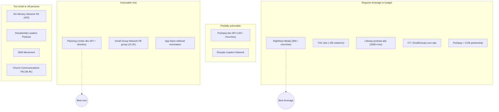

# Research Brief: Larger-Scale Reach Channels for FellowScript's Leader/Pastor Audience

Task: `20260911-fellowscript-larger-scale-reach` (Part 2, building on
`20260911-fellowscript-leader-identify-reach-pitch/conclusion.md`)

Baseline to beat, per Part 1: a faith.tools directory listing (subscriber counts in the hundreds) and
Small Group Network's ALIGN/ACCELERATE conferences (capped by physical attendance).
[ref: user-provided Part 1 conclusion]

## Summary

### Step 1 — RightNow Media as a channel

**Reach.** RightNow Media's own Global Reach page states 140 countries, 30,000+ subscribing churches,
4.5M+ users, 25,000+ videos, 13 languages [rightnowmedia.org/us/global]. The Wesleyan Church and the
Learn of Christ review site repeat these figures, but both are reproductions of vendor copy, not
independent measurement [wesleyan.org/rightnowmedia; learnofchrist.com/resources/rightnow-media].
RightNow's own pricing/partner page states a different figure — 20,000+ churches, schools, and
ministries who "partner" — which is never reconciled with the 30,000+ number anywhere on the site
[rightnowmedia.org/us/pricing]. Similarweb's free tier estimates the main marketing domain at roughly
990.9K visits/month (#7811 in Faith and Beliefs); most actual usage is likely inside church-branded
portals/apps, so this does not contradict the user claim, but it does mean the public site is not
itself the reach channel [similarweb.com/website/rightnowmedia.org/].

**Third-party access mechanism (Part 1's open question).** A pass across RightNow's FAQ, Launch
Resources, Tell Your Pastor, and RightNow @Work pages plus general search found no page, FAQ, or partner
program describing a way for a third-party app to buy sponsored placement, appear as a guest webinar, or
get into the monthly leader email. The only documented "partner" path is a church/organization
subscribing, i.e. becoming a customer. This is a documented absence of a public mechanism, not proof
that none exists privately — a direct inquiry via the demo-request form is the only remaining way to
close it [search: RightNow Media sponsorship/advertise/partner/guest-content mechanism].

**Classification:** requires leverage. Large vendor-stated reach, no public on-ramp for a vendor.

### Step 2 — Denominational and cross-church networks

- **Disciple Leaders Network** (formally Baptist Association of Christian Educators d/b/a DLN) is a real
  cross-church discipleship/small-groups network with a national conference and a "Become A Partner"
  section. Membership is free for pastors, staff, and volunteers leading Sunday School, small groups, or
  discipleship ministry (per SC Baptist Convention and Oklahoma Baptists promotional pages). No total
  member/church count is published, and partner terms for an outside vendor are not disclosed without
  direct contact. Roots and membership skew Baptist [discipleleaders.com; search: DLN free membership
  scope].
- **Assemblies of God "Disciple Well"** is a confirmed AG discipleship/small-groups initiative, but no
  member-church count or external-vendor access path was found [ag.org/ministries].
- **Discipleship.org** is a collaborative community of disciple-making networks hosting a National
  Disciple Making Forum; no aggregate church/leader count and no sponsorship/vendor mechanism was found
  [discipleship.org].
- **3DM Movement** is organized into regional hubs (~30 churches in the Fort Wayne hub); no aggregate
  figure exists in any source found — likely too small for this run's bar [search: 3DM Movement network
  scope].

**Classification:** DLN is partially actionable (free membership, a partner section, but unknown scale
and terms). The others are unquantified and have no documented vendor access.

### Step 3 — Curriculum publishers and ministry media beyond RightNow Media

- **The Gospel Coalition** sells display ads, sponsored content, podcast sponsorships, and event
  sponsorships, claiming 40M "active users," 2M+ listeners, 100K+ newsletter subscribers, and 15K event
  attendees; no pricing is published and placement goes through an account rep, first-come-first-served
  [thegospelcoalition.org/advertise-with-us/]. Similarweb independently estimates ~6.0M visits/month
  (global rank ~#15,153, #31 in Faith and Beliefs) — an order of magnitude below the 40M claim,
  suggesting the vendor figure is cumulative or loosely defined [similarweb.com/website/thegospelcoalition.org/].
- **Lifeway Leadership Podcast Network** claims 200,000+ Christians, leaders, teams, and decision makers
  reached monthly and sells host-read ads, custom content, and endorsements via a custom media plan
  [leadership.lifeway.com/podcasts/advertising/]. Listen Notes ranks network shows among the more popular
  of millions of podcasts, and one show ("5 Leadership Questions") is cited at close to 2M cumulative
  downloads — corroborating the general reach claim in kind, though lifetime downloads are not the same
  unit as monthly reach [search: Lifeway Leadership Podcast Network individual show downloads].
- **Christianity Today / SmallGroups.com.** CT's ad platform claims 4.5M+ Christian leaders reached
  monthly, 1.25M unique visitors, 2.2M page impressions, and 395,000 opt-in eblast subscribers across
  15+ eblasts. SmallGroups.com is one audience segment inside that and is not separately quantified
  [christianitytodayads.com/pastorsandchurchleaders].

**Classification:** all three are requires-leverage/budget channels — real audiences, paid access, custom
pricing via sales contact, and (for TGC/CT) a general church-leader audience rather than small-group
leaders specifically.

### Step 4 — ChMS marketplaces and integrations

- **Planning Center** runs a free, self-serve developer program: any developer can register an OAuth
  application against the public REST API without a partnership deal, and Planning Center invites
  completed integrations to be submitted for its public integrations directory
  [planningcenter.com/developers; api.planningcenteronline.com/docs/overview/getting-started].
  Its install base is contested: the current homepage states no total-churches figure (it cites "22K
  helpful members in our online communities"), faith.tools says "100,000+ churches," and Apps Run The
  World says "73,000 churches"; a December 2022 Semrush read (~686K visits/3mo, stale) does not resolve
  it [planningcenter.com homepage vs. faith.tools/app/276-planning-center vs. appsruntheworld.com].
- **Pushpay** states 14,000+ churches on its homepage, repeated consistently by a directory-style third
  party [pushpay.com; faith.tools Pushpay-adjacent listing]. It also runs a self-serve OAuth2 developer
  API (ChMS API v1/v2, Giving API) with sandbox and production credentials, but no public consumer-app
  partner/marketplace program with terms for leader-facing exposure was found
  [pushpay.com/developers/; pushpay.io/docs/introduction].
- **Church Community Builder** served 4,000+ US churches pre-acquisition by Pushpay; the combined
  customer base is cited around 10,000 (press release plus ChurchTechToday coverage)
  [search: Pushpay + Church Community Builder combined customer base].
- **ChurchTrac and Breeze** have small, non-marketplace integration ecosystems (Stripe, PraiseCharts,
  Mailchimp) with "no extensive app marketplace like Planning Center offers," consistently across GetApp,
  SourceForge, and ChurchTrac's own comparison page [search: ChurchTrac / Breeze integration ecosystem].

**Classification:** Planning Center is the clearest actionable-now channel in this run — a technical
build, not a business-development ask. Pushpay is partially actionable (API access yes, distribution
mechanism unclear). CCB/ChurchTrac/Breeze offer no scalable listing mechanism.

### Step 5 — Podcasts and YouTube channels

- **Group Answers Podcast** (Lifeway; the most directly small-group-leader-specific show) discloses no
  audience size, download count, or per-show sponsorship terms [leadership.lifeway.com/podcast-group-answers/].
- **Rainer on Leadership** has a Feedspot estimate of 10K-50K monthly listeners (wide, low-precision
  range) and 487 Apple Podcasts ratings at 4.8/5; its parent community Church Answers has 1,800+ paying
  members. General church-leadership, not small-group-specific [search: Rainer on Leadership podcast
  audience; churchanswers.com/about/].
- **Discipleship Leaders Podcast** (Fellowship Bible Church, single-church-produced) shows only 6 Apple
  ratings — a weak signal of a small audience [podcasts.apple.com .../id1700274746].
- The Lifeway Leadership Podcast Network's 200,000+/month network-wide figure (Step 3) is the only
  sourced podcast audience number that reaches the plan's bar, and it is vendor-stated.

No YouTube channel serving this persona with a sourced subscriber count was found in `sources.json`.

**Classification:** requires budget (Lifeway network ads, custom pricing). The small-group-specific
shows are unquantified or small.

### Step 6 — Facebook groups and online communities (Part 1's unresolved step)

Direct fetch of public Facebook group pages succeeded this run, resolving the Part 1 gap with real
platform-displayed counts:

- **Small Group Network's own group ("SGNContact")**: 15.2K members, ~19 posts/month, no new members in
  the past week — a real but low-engagement community [facebook.com/groups/SGNContact/].
- **Small Group Ministry Network**: 420 members — a distinct, small group [facebook.com/groups/158837360893790/].
- **Church Communications** (Katie Allred's community): 38.4K members, corroborated in direction by
  search-indexed "30,000+" to "35,000+" mentions — general church-communications audience, not
  small-group-specific [facebook.com/groups/churchcomm/].
- Katie Allred's curated list of 14+ church-leader groups confirms Small Group Network is the only
  small-group-ministry-specific entry; the rest serve children's, youth, worship, and communications
  niches [katieallred.com/church-facebook-groups/].

No subreddit, Discord, or Slack community for this persona appears in `sources.json`.

**Classification:** SGN's group is actionable now (free) but low-activity; the largest group found is
off-persona.

### Step 7 — App Store / Play Store faith-category placement

Five independent ASO-industry sources agree Apple's editorial team selects featured placements via a
pitch/nomination process (App Store Connect "Featuring → Nominations") based on design/technical quality
and engagement, submitted weeks to months ahead; it is not purchasable and not faith-category-specific.
No faith/Bible-category-specific discovery mechanism was found beyond this generic process
[search: Apple App Store featured-placement mechanics]. Google Play was not separately investigated
(see Risks).

**Classification:** actionable now in the sense of free to attempt, but generic, slow, and not reliably
scalable.

### Step 8 — Synthesis: actionable-now vs. requires-leverage

| Channel | Reach figure (source, caveat) | Cost / requirement | Classification |
|---|---|---|---|
| Planning Center dev API + integrations directory | 73K-100K churches (two conflicting third parties; not on PC's own homepage) | Engineering time; free OAuth registration; submit integration for directory | Actionable now |
| Small Group Network Facebook group | 15.2K members, ~19 posts/mo (direct platform read) | Free | Actionable now, low engagement |
| Apple App Store editorial featuring | Generic; no faith-specific figure | Free nomination; quality bar; weeks-months lead | Actionable now, unreliable |
| Pushpay developer API | 14K+ churches (vendor-stated, consistent) | Free API; no consumer-app partner program found | Partially actionable |
| Disciple Leaders Network | No published count | Free membership; partner terms undisclosed | Partially actionable |
| RightNow Media | 30K+ churches / 4.5M users (vendor-stated; 20K+ on pricing page) | No public vendor mechanism; direct ask only | Requires leverage |
| The Gospel Coalition ads | ~6M visits/mo (Similarweb) vs. 40M claimed | Custom pricing via rep | Requires budget |
| Lifeway Leadership Podcast Network ads | 200K+/mo (vendor-stated) | Custom media plan | Requires budget |
| Christianity Today / SmallGroups.com ads | 395K eblast subs, 4.5M+ leaders/mo (vendor-stated; SmallGroups.com not broken out) | Custom pricing | Requires budget |
| Pushpay + CCB | ~10K churches combined (press + trade press) | Partnership ask | Requires leverage |
| Small Group Ministry Network FB group | 420 members | Free | Too small |
| Discipleship Leaders Podcast | 6 Apple ratings | Unknown | Too small |
| 3DM Movement | ~30 churches per regional hub; no aggregate | Unknown | Too small |
| Church Communications FB group | 38.4K members | Free | Off-persona |

The sources support naming **Planning Center's open developer program** as the single best
actionable-now candidate (free, self-serve, a listing path, and the largest install base in the ChMS
set even at the lower 73K figure) and **RightNow Media** as the single most promising requires-leverage
candidate (the largest on-persona subscribing-church base found, with the open question closable only by
a direct ask).

## Citations

All references resolve to entries in `sources.json` by `url_or_ref`:

- `https://www.rightnowmedia.org/us/global` — RightNow reach figures (vendor-stated)
- `https://www.wesleyan.org/rightnowmedia` — denominational repetition of RightNow figures
- `https://learnofchrist.com/resources/rightnow-media` — review-site repetition of RightNow figures
- `https://www.rightnowmedia.org/us/pricing` — 20,000+ partner figure (internal discrepancy)
- `search: RightNow Media sponsorship/advertise/partner/guest-content mechanism` — no public vendor mechanism
- `https://www.similarweb.com/website/rightnowmedia.org/` — ~990.9K visits/month
- `https://www.discipleleaders.com/` — DLN existence, partner section, no count
- `search: Disciple Leaders Network free membership scope` — DLN free membership
- `https://ag.org/ministries` — AG Disciple Well
- `https://discipleship.org/` — Discipleship.org
- `search: 3DM Movement network scope` — ~30 churches per hub
- `https://www.thegospelcoalition.org/advertise-with-us/` — TGC ad offerings and claimed reach
- `https://www.similarweb.com/website/thegospelcoalition.org/` — TGC ~6M visits/month
- `https://leadership.lifeway.com/podcasts/advertising/` — Lifeway network 200K+/month, ad products
- `https://leadership.lifeway.com/podcast-group-answers/` — Group Answers, no figures
- `https://podcasts.apple.com/us/podcast/discipleship-leaders-podcast/id1700274746` — 6 ratings
- `https://churchanswers.com/about/` — Church Answers 1,800+ members
- `search: Rainer on Leadership podcast audience` — 10K-50K est., 487 ratings
- `search: Lifeway Leadership Podcast Network individual show downloads` — ~2M cumulative downloads
- `https://christianitytodayads.com/pastorsandchurchleaders` — CT ad platform figures
- `https://www.planningcenter.com/developers` — PC self-serve developer program and directory
- `https://www.planningcenter.com/ (homepage) vs. faith.tools vs. appsruntheworld.com` — contested PC church count
- `https://pushpay.com/ (homepage)` — 14,000+ churches
- `https://pushpay.com/developers/` — Pushpay developer API, no consumer-app partner program
- `search: Pushpay + Church Community Builder combined customer base` — 4,000+ / ~10,000
- `search: ChurchTrac / Breeze integration ecosystem scope` — small, non-marketplace ecosystems
- `https://www.facebook.com/groups/SGNContact/` — 15.2K members, ~19 posts/month
- `https://www.facebook.com/groups/158837360893790/` — 420 members
- `https://www.facebook.com/groups/churchcomm/` — 38.4K members
- `https://katieallred.com/church-facebook-groups/` — SGN sole small-group-specific entry
- `search: Apple App Store featured-placement mechanics` — editorial nomination process
- `user-provided: Part 1 conclusion` — baseline and open questions

## Risks

**Vendor-stated reach figures dominate.** Every large number in this brief — RightNow's 30,000+/4.5M,
TGC's 40M, Lifeway's 200,000+/month, CT's 4.5M+/395K, Pushpay's 14,000+ — originates in the vendor's own
marketing or ad-sales copy. Third-party "corroboration" for RightNow (Wesleyan Church, Learn of Christ)
merely repeats vendor copy. Only TGC and RightNow have an independent traffic read, and TGC's shows a
roughly 6-7x gap between the vendor claim and the independent estimate.

**Internal and cross-source discrepancies.**
- RightNow Media: 30,000+ subscribing churches (Global Reach page) vs. 20,000+ partners (pricing page),
  unreconciled.
- Planning Center: 73,000 (Apps Run The World) vs. 100,000+ (faith.tools), with no current first-party
  figure. The "best actionable-now" designation rests partly on install-base size, so this matters.
- Lifeway: the ~2M cumulative-download corroboration is a different unit from the 200,000+/month claim
  and should not be read as confirming it.

**Single-source claims.** Most entries have `corroboration_count: 1`. The Planning Center developer-program
finding (the run's headline actionable channel) is sourced only from Planning Center's own developer
docs; the existence of the directory-submission path is not independently corroborated, and nothing in
the sources says how many integrations are listed, how visible the directory is to church staff, or
whether a consumer-facing small-group app fits its intended scope.

**Facebook counts are platform-displayed, single-read.** The 15.2K / 420 / 38.4K figures come from a
single direct fetch of public group pages; only Church Communications has directional external
corroboration. The "~19 posts/month, no new members in past week" activity read is a point-in-time
snapshot.

**Similarweb free-tier data is noisy.** The RightNow read returned a partly garbled global-rank string;
the visits figure is described as "directionally usable" only.

**Persona fit is loose for the largest channels.** TGC, CT's broader platform, Church Communications,
Rainer on Leadership, and Church Answers are general church-leader or communications audiences. The only
channels squarely on the small-group-leader persona (Group Answers Podcast, SGN's Facebook group, Small
Group Ministry Network, DLN) are either unquantified or small.

**Gaps carried forward from the gathering agent (round cap reached):**
1. Whether RightNow Media accepts sponsored/guest third-party content in its leader email or webinars
   was neither confirmed nor denied by any published source — only a documented absence of a public
   mechanism. A direct inquiry is the only way to close it.
2. No podcast or YouTube channel serving small-group leaders specifically has an independently verified,
   precise audience number. No YouTube channel of any kind was sourced.
3. No denominational/parachurch network (DLN, AG Disciple Well, Discipleship.org, 3DM) could be pinned
   to a hard member count, and none publicly documents external-vendor access terms.
4. Planning Center's own current total-churches figure is unresolved (see discrepancy above).
5. Google Play faith-category dynamics were not separately investigated; only Apple's generic editorial
   process was checked. No subreddit/Discord/Slack communities were investigated.

## Open questions

1. Is Planning Center's integrations directory a real distribution channel or just a developer catalog?
   What proportion of Planning Center's church customers browse it, and would a small-group note-taking
   app be accepted or be seen as outside the ChMS-integration scope? The sources establish the on-ramp
   exists but nothing about its downstream reach.
2. Which Planning Center install-base figure (73K vs. 100K+) is closer to current reality, and does the
   "best actionable-now" ranking survive if the true figure is the lower one or lower still?
3. Does the RightNow Media 30,000+ vs. 20,000+ discrepancy indicate two metrics (all subscribers vs.
   donor-subsidized partners) or an inflated headline figure? Does the 4.5M "users" figure represent
   active accounts or cumulative registrations?
4. Is TGC's 40M "active users" claim a cumulative-reach metric, and by extension should Lifeway's
   200,000+/month and CT's 4.5M+/month be discounted by a similar factor absent independent traffic data?
5. Are any of the "requires budget" channels (Lifeway network host-read ads, TGC sponsored content, CT
   eblasts) actually priced within a lean team's range? No pricing was published anywhere; "requires
   budget" is inferred from custom-quote sales processes, not from a known price.
6. Does Disciple Leaders Network's "Become A Partner" program admit software vendors, and at what scale
   does DLN actually operate? It is the only free-membership, on-persona, cross-church network found,
   but it is entirely unquantified.
7. Does a low-activity 15.2K-member Facebook group (SGN) outperform a hundreds-of-subscribers faith.tools
   listing in practice, given ~19 posts/month? Member count and reachable audience are not the same
   thing.
8. Is there a Google Play faith-category mechanism, or a recurring Apple curated "Bible study"
   collection, that this run's Apple-only check missed?
9. Has a channel been missed entirely: YouTube channels for small-group leaders, ministry-staff
   newsletters with sponsorship slots, or larger conferences (e.g. multi-thousand-attendee pastor
   conferences) that reach this persona beyond SGN's events? None of these appear in `sources.json`.
