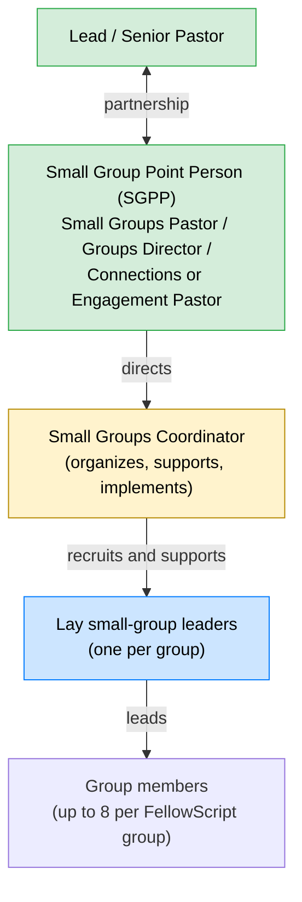

# Research Brief: Identifying, Reaching, and Pitching FellowScript to Small-Group Leaders/Pastors

Task: `20260911-fellowscript-leader-identify-reach-pitch`
Stage: sourcing (step 3, research brief)
Inputs: `research-plan.md`, `sources.json` (26 entries, all freshly found; no user-provided sources), `source-gathering.json` (3 rounds, 5 flagged gaps)

Every substantive claim below cites an entry in `sources.json` by URL. Claims labeled **[cross-domain]** rest on non-faith-specific sources and are analogies, not faith-specific precedent. Claims labeled **[reasoned inference]** are the brief author's synthesis across sources, not a claim any single source makes.

---

## Summary

### Step 1 — Identification mechanics

The sources support three concrete, scalable ways to find the *decision-making* role (the person who oversees a church's small-group ministry), plus one per-church method for finding *lay* leaders.

**Church job boards name churches actively staffing the role.** ChurchStaffing.com maintains a live "Small Group Pastor" job category listing named churches hiring for dedicated small-group roles; example churches at time of gathering included Ada Bible Church, CrossWinds Church, The MET Church, Revolution Church, The Church Next Door, CrossPoint Community Church, and Impact Church (https://www.churchstaffing.com/jobs/category/small-group-pastor/). ZipRecruiter independently corroborates the same signal and adds a compensation range of $42k-$62k for the role (https://www.ziprecruiter.com/Jobs/Small-Group-Pastor). A church posting this job is, by definition, a church that has decided small groups warrant a paid staff owner — which makes the job-board category page a durable, checkable identification feed even as individual postings expire.

**The role goes by a documented set of title variants, which form a search-string set.** ChurchLeaders documents that the small-group decision-maker's title varies by church size and structure: Small Groups Pastor, Groups Director/Pastor, Connections Pastor, Engagement Pastor, and Pastor of Discipleship and Care (https://churchleaders.com/smallgroups/small-group-articles/156661-the-job-description-of-a-small-group-director.html). Small Group Network's own materials use the umbrella term "Small Group Point Person (SGPP)" for the same role (https://smallgroupnetwork.com/align-accelerate/). **[reasoned inference]** These title variants are the search terms to use on LinkedIn, job boards, and church staff pages; searching only "small group pastor" would miss the Connections/Engagement/Discipleship-titled holders of the same role.

**Church-software customer bases are a proxy for churches with active small-group programs.** ChurchTrac markets a small-group management module to a stated 14,000+ churches (https://www.churchtrac.com/solutions/group-leaders). RightNow Media reports serving 30,000+ churches and 4 million+ users (https://www.rightnowmedia.org/blog/rightnowmedia-story). These customer bases are self-selected for having organized small-group ministries, though neither vendor publishes a customer list — see Risks.

**Per-church directories surface lay leader names, but do not scale.** Individual churches commonly publish member/staff/group directories listing group leader names and contact info via tools like Instant Church Directory (https://www.instantchurchdirectory.com/online-member-directory). This is a one-church-at-a-time mechanic, not a population-level one.

**Public clergy directories exist but target the wrong population.** The Christian Leaders Alliance ordination directory is searchable by name, location, and credential, but covers ordained/credentialed ministers broadly rather than lay small-group leaders (https://www.christianleadersalliance.org/christian-leaders-alliance-ordination-directory/).

The sources, taken together, describe the following church-side hierarchy. Green roles are where adoption decisions sit; the yellow role implements; blue is the lay leader whose buy-in unlocks a group under FellowScript's model.

Sources for the hierarchy: title variants and role scope from ChurchLeaders (https://churchleaders.com/smallgroups/small-group-articles/156661-the-job-description-of-a-small-group-director.html); coordinator scope from UMC Discipleship Ministries (https://www.umcdiscipleship.org/resources/small-group-coordinator) and the CRC Network (https://network.crcna.org/topic/spiritual-formation/small-groups/anyone-have-well-thought-out-job-description-small-groups); coordinator as a real paid role from ChurchStaffing.com (https://www.churchstaffing.com/job/251602/small-groups-coordinator/community-of-faith). The "up to 8 members" figure is FellowScript's own model as stated in the research plan, not an external source. **[reasoned inference]** The arrows labeled "partnership" and "directs" are a synthesis of the UMC/CRC role descriptions, which state the coordinator works "in partnership with the lead pastor"; no single source draws this org chart.

### Step 2 — Where leaders self-organize online

This is the weakest-sourced step. Named Facebook groups for church leaders exist and are joinable — Katie Allred's list includes one branded "Small Group Network," though most of the listed groups target adjacent niches (children's ministry, worship, youth ministry, general senior pastors) rather than small-group leaders specifically (https://katieallred.com/church-facebook-groups/). No member counts, activity levels, or access models were retrievable for any of these groups (see Risks). The gathering agent found no dedicated subreddit or Discord server for small-group leaders/pastors specifically; the closest near-miss is Church IT Network's Discord, which is general church-tech (per `source-gathering.json` gaps — not a `sources.json` entry, so treat as a reported absence rather than a positive finding).

### Step 3 — Curriculum and small-group-network ecosystems

**RightNow Media is the largest documented self-selected small-group-leader population.** It reports 30,000+ churches in 100+ countries, 4 million+ users, 25,000+ Bible study videos, and sends leaders a monthly "how to lead an effective small group" email (https://www.rightnowmedia.org/blog/rightnowmedia-story and https://www.rightnowmedia.org/blog/rightnow-media-global-reach). The monthly leader email is a documented co-marketing surface; whether RightNow Media accepts third-party content in it is not documented.

**Small Group Network is a named cross-church network with an explicit SGPP audience.** Its homepage and conference pages state the audience as "For Small Group Pastors" (https://smallgroupnetwork.com/conferences/ and https://smallgroupnetwork.com/). Its events are covered under Step 4.

**faith.tools is a previously undiscovered, low-barrier listing channel.** It is an independently run, church-leader-facing curated directory of 50+ small-group apps, filterable by platform, with a free submission path (go.faith.tools/submit; the operator notes "I list apps when I can") and a paid sponsorship/premium-placement option at faith.tools/sponsor (https://faith.tools/small-groups and https://faith.tools/for-pastors). This is the most directly actionable reach item in the source set: it is free, self-serve, and puts FellowScript in front of the exact persona browsing for small-group apps.

**A named individual practitioner is a plausible guest-content or referral intermediary.** Mark Howell (MarkHowellLive.com / SmallGroupResources.net) has 20+ years as a Groups Pastor at named large churches, 1,100+ blog posts, and is a ChurchLeaders contributor, with an existing audience of small-group leaders reached through blogging, coaching calls, and consulting (https://www.markhowelllive.com/about/ and https://www.linkedin.com/in/markchowell/). This is a documented audience, not a documented willingness to partner.

**Correction to the plan: "LifeGroups.com" is not a distinct network.** The search resolved only to Life.Church's internal "LifeGroups" program branding and resources for its own congregation (https://open.life.church/training/211-lifegroups-small-groups-know-feel-do and https://open.life.church/resources/3338-lifegroup-resources). It should not be cited as a cross-church curriculum publisher or network. Lifeway and The Gospel Coalition, also named in the plan, do not appear in `sources.json` and were not sourced.

### Step 4 — Conferences and events

Small Group Network runs named, recurring training events explicitly targeting Small Group Point People: ALIGN (one day) and ACCELERATE (two days). Documented pricing: $124 per course individually; $209/individual (or $189-199 team rate) for the in-person ACCELERATE event; and a $49/month ALL ACCESS subscription that includes all courses plus 50% off in-person events (https://smallgroupnetwork.com/align-accelerate/). This converts the prior run's unsubstantiated "champion-sourcing through conference networking" claim into concrete cost-to-attend numbers for a small team. Exhibitor/sponsor pricing was not found — only attendee pricing. No other small-group-specific conference was sourced.

### Step 5 — Direct-outreach mechanics and scripts

**No faith-specific cold-outreach script or DM template aimed at pastors or small-group leaders was found**, consistent with both prior research runs (https://leadhaste.com/blog/cold-email-template-for-education, whose own claim set records this absence; and `source-gathering.json` gaps).

**[cross-domain]** The closest available analog is EdTech cold outreach aimed at superintendents, curriculum directors, and IT directors. LeadHaste provides literal template text: short, hyper-personalized subject lines (e.g., `{{first_name}}, your {{district_name}} literacy plan`) and body copy framed as "a thoughtful note from a peer" rather than a sales blast (https://leadhaste.com/blog/cold-email-template-for-education). Three further EdTech practitioner sources corroborate the same structural pattern: identify an internal champion (a teacher) whose peer endorsement outweighs any vendor pitch; keep messages to 50-125 words; lead with a specific institutional pain point; frame around outcomes rather than features (https://moderninbound.com/blog/cold-email-for-edtech-companies, https://telecrm.in/blog/sales-pitch-for-edtech/, https://firstsales.io/sales-guide/edtech-sales-pitch/). **[reasoned inference]** Mapping to FellowScript: the "teacher" champion maps to the lay small-group leader, the "district" personalization token maps to the named church and group, and the "superintendent" maps to the SGPP/lead pastor — but this mapping is the brief's, not any source's.

### Step 6 — Pitch content and messaging angles

**Tool-consolidation framing has a documented basis, from an interested party.** Subsplash reports that church staff and leaders experience decision fatigue from managing multiple disconnected tools, with data in silos and confused users (https://www.subsplash.com/blog/the-hidden-roadblock-to-ministry-growth). This supports positioning FellowScript as replacing scattered group texts and paper notes rather than adding "another app" — but Subsplash sells church software and is commercially motivated to make exactly this argument.

**Timing windows.** Two faith-specific practitioner sources identify September (school-year start) and January (calendar-year start) as the two highest-attention windows for small-group messaging (https://www.smallgroups.com/articles/2013/effective-marketing-for-small-group-ministry.html and https://stephenblandino.com/2011/11/7-push-pull-strategies-to-promote-your-small-groups.html). Scope caveat: both describe churches recruiting congregants into groups, not vendors pitching tools to leaders; the timing transfers only as an inference that leaders are most focused on group logistics in those windows.

**Peer-testimonial proof-point format.** SmartGroups, FellowScript's closest named comparable, displays user testimonials praising organization and keeping the whole group "on the same page" (https://smartgroups.app/, https://smartgroups.app/faqs, and its app-store listings). This is an example of the format, not evidence that it converts.

No source documents messaging language specific to *time-savings for leaders* or *deepening group engagement* as tested value propositions for this persona; those angles from the plan remain unsourced.

### Step 7 — Objection handling and proof points

Four objection categories from the plan now each have at least one source, and three have a non-vendor source:

| Objection | Evidence | Source tier |
|---|---|---|
| Cost to the leader | SmartGroups removes it structurally: a free tier for a single small group with full features and no credit card, with paid church plans from $59/month for multiple groups (https://smartgroups.app/faqs) | Competitor's own pricing page (checkable) |
| "Another app" fatigue | Tool-fragmentation decision fatigue reported among church staff/leaders (https://www.subsplash.com/blog/the-hidden-roadblock-to-ministry-growth) | Vendor blog |
| Screen-time in church context | Some pastors actively discourage phone/app use in church settings and treat well-intentioned technology invitations as distraction sources (https://www.christianitytoday.com/2024/10/a-vision-for-screen-free-church-smartphones-livestreaming/) | Editorially independent publication |
| Data privacy | Church data-management/app adoption carries documented breach risk (identity theft, financial fraud, unauthorized access) (https://rsisinternational.org/journals/ijriss/articles/ethical-challenges-of-integrating-digital-technology-into-church-leadership-and-discipleship/); independent journalism reports live surveillance/tracking concerns in faith apps generally (https://newrepublic.com/article/179397/evangelical-app-targeting-immigrants-surveillance and https://sojo.net/magazine/november-2022/your-church-watching-you) | Academic + independent journalism |
| Doctrinal/content safety | Rapid technology adoption in ministry carries a documented risk to doctrinal integrity/oversight (same rsisinternational.org article); one adjacent product, Doctrinally.AI, markets on grounding answers in a church's own sermons/documents (https://www.chmeetings.com/blog/how-to-use-ai-in-churches/) | Academic + single weak vendor mention |

The SmartGroups free-single-group tier is the one *documented offer structure* in the source set. **[reasoned inference]** It resolves the cost objection at exactly the leader-first entry point FellowScript targets, and is therefore the structure FellowScript should either match or explicitly differentiate against. Tech-literacy of older congregants — named in the plan — has no source.

No source documents a live demo at a first meeting, a pilot-terms framework, or an onboarding script as a proof-point format for this persona.

### Step 8 — Ministry-coordinator angle

The prior run's finding holds up and is now corroborated by three independent sources across two denominations and a job board. The UMC's Discipleship Ministries describes the Small Group Coordinator as supporting, organizing, and implementing small-group ministry in partnership with the lead pastor — not as an independent decision-maker (https://www.umcdiscipleship.org/resources/small-group-coordinator). A CRC Network practitioner thread describes the same scope (https://network.crcna.org/topic/spiritual-formation/small-groups/anyone-have-well-thought-out-job-description-small-groups). ChurchStaffing.com confirms "Small Groups Coordinator" is an actual paid staffing category, distinct from "Small Groups Pastor" (https://www.churchstaffing.com/job/251602/small-groups-coordinator/community-of-faith). No source offers a coordinator-specific pitch angle; **[reasoned inference]** the coordinator is an implementation ally to equip after the SGPP or lay leader decides, not a first-contact target.

### Success-criteria check

Against the plan's bar of "at least one concrete, checkable tactic more specific than the prior runs" per question:

- **Identify**: job-board category feeds with named churches; a documented title-variant search set. Met.
- **Reach**: faith.tools free submission + paid sponsorship; Small Group Network ALIGN/ACCELERATE with attendee pricing; RightNow Media scale and monthly leader email. Met.
- **Pitch**: SmartGroups' free-single-group tier as a documented offer structure; four objection categories with independently sourced evidence. Met, with the caveat that pitch *language* remains cross-domain or inferred.

---

## Risks

**Reliability gaps**

- Vendor-sourced scale numbers (ChurchTrac 14,000+, RightNow Media 30,000+ churches / 4M+ users) are self-reported and unaudited. They are specific and falsifiable, but the brief treats them as claims, not verified facts (https://www.churchtrac.com/solutions/group-leaders; https://www.rightnowmedia.org/blog/rightnowmedia-story).
- The Subsplash tool-fragmentation claim comes from a vendor whose business depends on that narrative (https://www.subsplash.com/blog/the-hidden-roadblock-to-ministry-growth). It is the only source for the "another app" objection.
- The Doctrinally.AI proof-point example is a single mention in a competitor-vendor blog, not a case study (https://www.chmeetings.com/blog/how-to-use-ai-in-churches/).
- The rsisinternational.org journal article is open-access academic, but the journal's rigor tier was not independently verified.
- The New Republic / Sojourners privacy reporting concerns ad-targeting and tracking apps, not small-group tools — tangential corroboration only.
- The two timing-window sources are from 2011 and 2013 and address congregant recruitment, not tool adoption.
- All four EdTech sources are commercially interested sales-consulting content.

**Conflicting or unresolved plan assumptions**

- The plan named "LifeGroups.com" as a network; it is not one. Lifeway and The Gospel Coalition were named but not sourced at all.
- Job-board signals identify churches *large enough to fund a paid small-group role*. FellowScript's inferred audience (small/independent/non-denominational churches, per the plan) may be under-represented in that feed — a possible mismatch between the identification mechanic and the target segment. No source addresses this directly.

**Gaps reported by the gathering agent at its round cap** (from `source-gathering.json`)

1. No member counts or activity levels for any small-group-leader Facebook group (Facebook/Reddit block static fetch; browser automation was unavailable in the environment).
2. No dedicated subreddit or Discord for small-group leaders/pastors found; Church IT Network's Discord is a general-church-tech near-miss.
3. No faith-specific cold-outreach script or DM template exists in the source set — only the EdTech analog.
4. Called App's group-messaging best-practices page (called.app/resources/best-practices-for-christian-group-messaging/) returned HTTP 403 and could not be read; it is not cited.
5. The "LifeGroups.com" correction above.

**Plan items with no source at all**

- Exhibitor/sponsor pricing at any conference (only attendee pricing found).
- Tech-literacy of older congregants as an objection.
- Live-demo, pilot-terms, or first-meeting onboarding script as proof-point formats.
- "Time-savings for leaders" and "deepening group engagement" as tested messaging angles.
- LinkedIn group or hashtag-based identification (the plan's LinkedIn angle is supported only by inference from the title-variant list).
- Denominational small-group networks beyond the UMC/CRC coordinator-role references.

---

## Open questions

For the critiquing stage to probe:

1. **Does the job-board identification mechanic actually reach FellowScript's segment?** Churches posting paid Small Groups Pastor roles skew larger; the plan's inferred audience is small/independent churches. Is there evidence the two overlap, or does this tactic need a different feed for the small-church segment?
2. **Is faith.tools real reach or just a listing?** No traffic, referral, or conversion data was found. The critiquing stage should look for any evidence of what listing there produces — and whether the operator's "I list apps when I can" implies a meaningful backlog.
3. **Does RightNow Media's monthly leader email accept third-party content?** The channel is documented; its openness to co-marketing is not.
4. **Does the SmartGroups free-single-group tier actually convert to paid church plans?** It is presented as an objection-handling structure, but no evidence of its effectiveness exists in the source set. Counter-evidence could show free tiers in this space stall rather than convert.
5. **Does the EdTech teacher-champion analog transfer to lay small-group leaders?** Teachers are paid professionals inside an institution with procurement budgets; lay small-group leaders are volunteers. The critiquing stage should test whether the champion dynamic survives that difference.
6. **Is the screen-free-church posture a minority view or a mainstream trend?** One Christianity Today piece establishes the objection exists; its prevalence among FellowScript's target churches is unknown.
7. **Is the September/January timing claim durable?** Both sources are 11-15 years old and describe a different marketing motion.
8. **Are the Facebook groups worth anything?** Without size/activity data, the entire online-community reach channel (Step 2) is unevaluated. The critiquing stage may have tooling access the gathering agent lacked.
9. **Is Mark Howell (or any equivalent practitioner) actually open to partnership?** Audience existence is documented; willingness is not, and the risk of overstating a "channel" that is really one person's blog should be tested.
